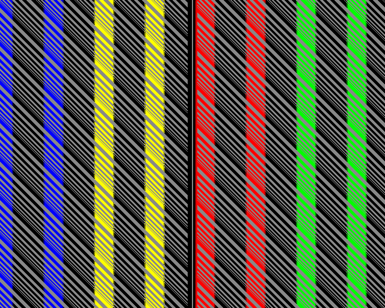

Amiga Latency Test ROM (PAL HiRes interlaced)
=============================================

Just another custom ROM for testing display latency on classic PAL Amigas.

The diagonal background pattern is moved one line upwards every full _frame_,
and the color bars are moved 2 pixels (1 LoRes) left every _field_ (4/frame).

There is an additional vertical line in the center of the display.
The LED brightness is toggled when the left side of any color bar
hits the vertical line in this field (remember, every other line),
and a very short tone is played (a field lasts for 2/100 seconds).  
The color bar movement is paused as long as the left mouse button
is held down. Here is the game: Listen to the tone and/or look at
the power LED, and try to stop a color bar as near as possible to
the center line - Good luck, and better less than more input lag.

Please notice that I do not know the latency of the LED/circuitry.  
This test has been developed to compare a CRT and TFT in parallel.

License
-------

This work is 'public domain' and licensed under the [CC0 1.0 Universal] license.

- [TLDRLegal: CC0 1.0 Universal](https://www.tldrlegal.com/license/creative-commons-cc0-1-0-universal)
- [gnu.org/licenses: CC0 1.0 Universal](https://www.gnu.org/licenses/license-list.html#CC0)

This project attempts to conform to the [REUSE] recommendations.

[CC0 1.0 Universal]: LICENSES/CC0-1.0.txt
[REUSE]: https://reuse.software/

